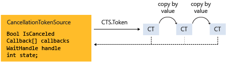

# Cancellation in Managed Threads
Starting with the [!INCLUDE[net_v40_long](../../../includes/net-v40-long-md.md)], the .NET Framework uses a unified model for cooperative cancellation of asynchronous or long-running synchronous operations. This model is based on a lightweight object called a cancellation token. The object that invokes one or more cancelable operations, for example by creating new threads or tasks, passes the token to each operation. Individual operations can in turn pass copies of the token to other operations. At some later time, the object that created the token can use it to request that the operations stop what they are doing. Only the requesting object can issue the cancellation request, and each listener is responsible for noticing the request and responding to it in an appropriate and timely manner.  
  
 The general pattern for implementing the cooperative cancellation model is:  
  
-   Instantiate a <xref:System.Threading.CancellationTokenSource> object, which manages and sends cancellation notification to the individual cancellation tokens.  
  
-   Pass the token returned by the <xref:System.Threading.CancellationTokenSource.Token%2A?displayProperty=nameWithType> property to each task or thread that listens for cancellation.  
  
-   Provide a mechanism for each task or thread to respond to cancellation.  
  
-   Call the <xref:System.Threading.CancellationTokenSource.Cancel%2A?displayProperty=nameWithType> method to provide notification of cancellation.  
  
> [!IMPORTANT]
>  The <xref:System.Threading.CancellationTokenSource> class implements the <xref:System.IDisposable> interface. You should be sure to call the <xref:System.Threading.CancellationTokenSource.Dispose%2A?displayProperty=nameWithType> method when you have finished using the cancellation token source to free any unmanaged resources it holds.  
  
 The following illustration shows the relationship between a token source and all the copies of its token.  
  
   
  
 The new cancellation model makes it easier to create cancellation-aware applications and libraries, and it supports the following features:  
  
-   Cancellation is cooperative and is not forced on the listener. The listener determines how to gracefully terminate in response to a cancellation request.  
  
-   Requesting is distinct from listening. An object that invokes a cancelable operation can control when (if ever) cancellation is requested.  
  
-   The requesting object issues the cancellation request to all copies of the token by using just one method call.  
  
-   A listener can listen to multiple tokens simultaneously by joining them into one *linked token*.  
  
-   User code can notice and respond to cancellation requests from library code, and library code can notice and respond to cancellation requests from user code.  
  
-   Listeners can be notified of cancellation requests by polling, callback registration, or waiting on wait handles.  
  
## Cancellation Types  
 The cancellation framework is implemented as a set of related types, which are listed in the following table.  
  
|Type name|Description|  
|---------------|-----------------|  
|<xref:System.Threading.CancellationTokenSource>|Object that creates a cancellation token, and also issues the cancellation request for all copies of that token.|  
|<xref:System.Threading.CancellationToken>|Lightweight value type passed to one or more listeners, typically as a method parameter. Listeners monitor the value of the `IsCancellationRequested` property of the token by polling, callback, or wait handle.|  
|<xref:System.OperationCanceledException>|Overloads of this exception's constructor accept a <xref:System.Threading.CancellationToken> as a parameter. Listeners can optionally throw this exception to verify the source of the cancellation and notify others that it has responded to a cancellation request.|  
  
 The new cancellation model is integrated into the [!INCLUDE[dnprdnshort](../../../includes/dnprdnshort-md.md)] in several types. The most important ones are <xref:System.Threading.Tasks.Parallel?displayProperty=nameWithType>, <xref:System.Threading.Tasks.Task?displayProperty=nameWithType>, <xref:System.Threading.Tasks.Task%601?displayProperty=nameWithType> and <xref:System.Linq.ParallelEnumerable?displayProperty=nameWithType>. We recommend that you use this new cancellation model for all new library and application code.  
  
## Code Example  
 In the following example, the requesting object creates a <xref:System.Threading.CancellationTokenSource> object, and then passes its <xref:System.Threading.CancellationTokenSource.Token%2A> property to the cancelable operation. The operation that receives the request monitors the value of the <xref:System.Threading.CancellationToken.IsCancellationRequested%2A> property of the token by polling. When the value becomes `true`, the listener can terminate in whatever manner is appropriate. In this example, the method just exits, which is all that is required in many cases.  
  
> [!NOTE]
>  The example uses the <xref:System.Threading.ThreadPool.QueueUserWorkItem%2A> method to demonstrate that the new cancellation framework is compatible with legacy APIs. For an example that uses the new, preferred <xref:System.Threading.Tasks.Task?displayProperty=nameWithType> type, see [How to: Cancel a Task and Its Children](../../../docs/standard/parallel-programming/how-to-cancel-a-task-and-its-children.md).  
  
 [!code-csharp[Cancellation#1](../../../samples/snippets/csharp/VS_Snippets_Misc/cancellation/cs/cancellationex1.cs#1)]
 [!code-vb[Cancellation#1](../../../samples/snippets/visualbasic/VS_Snippets_Misc/cancellation/vb/cancellationex1.vb#1)]  
  
## Operation Cancellation Versus Object Cancellation  
 In the new cancellation framework, cancellation refers to operations, not objects. The cancellation request means that the operation should stop as soon as possible after any required cleanup is performed. One cancellation token should refer to one "cancelable operation," however that operation may be implemented in your program. After the <xref:System.Threading.CancellationToken.IsCancellationRequested%2A> property of the token has been set to `true`, it cannot be reset to `false`. Therefore, cancellation tokens cannot be reused after they have been canceled.  
  
 If you require an object cancellation mechanism, you can base it on the operation cancellation mechanism by calling the <xref:System.Threading.CancellationToken.Register%2A?displayProperty=nameWithType> method, as shown in the following example.  
  
 [!code-csharp[Cancellation#2](../../../samples/snippets/csharp/VS_Snippets_Misc/cancellation/cs/objectcancellation1.cs#2)]
 [!code-vb[Cancellation#2](../../../samples/snippets/visualbasic/VS_Snippets_Misc/cancellation/vb/objectcancellation1.vb#2)]  
  
 If an object supports more than one concurrent cancelable operation, pass a separate token as input to each distinct cancelable operation. That way, one operation can be cancelled without affecting the others.  
  
## Listening and Responding to Cancellation Requests  
 In the user delegate, the implementer of a cancelable operation determines how to terminate the operation in response to a cancellation request. In many cases, the user delegate can just perform any required cleanup and then return immediately.  
  
 However, in more complex cases, it might be necessary for the user delegate to notify library code that cancellation has occurred. In such cases, the correct way to terminate the operation is for the delegate to call the <xref:System.Threading.CancellationToken.ThrowIfCancellationRequested%2A>, method, which will cause an <xref:System.OperationCanceledException> to be thrown. Library code can catch this exception on the user delegate thread and examine the exception's token to determine whether the exception indicates cooperative cancellation or some other exceptional situation.  
  
 The <xref:System.Threading.Tasks.Task> class handles <xref:System.OperationCanceledException> in this way. For more information, see [Task Cancellation](../../../docs/standard/parallel-programming/task-cancellation.md).  
  
### Listening by Polling  
 For long-running computations that loop or recurse, you can listen for a cancellation request by periodically polling the value of the <xref:System.Threading.CancellationToken.IsCancellationRequested%2A?displayProperty=nameWithType> property. If its value is `true`, the method should clean up and terminate as quickly as possible. The optimal frequency of polling depends on the type of application. It is up to the developer to determine the best polling frequency for any given program. Polling itself does not significantly impact performance. The following example shows one possible way to poll.  
  
 [!code-csharp[Cancellation#3](../../../samples/snippets/csharp/VS_Snippets_Misc/cancellation/cs/cancellationex11.cs#3)]
 [!code-vb[Cancellation#3](../../../samples/snippets/visualbasic/VS_Snippets_Misc/cancellation/vb/cancellationex11.vb#3)]  
  
 For a more complete example, see [How to: Listen for Cancellation Requests by Polling](../../../docs/standard/threading/how-to-listen-for-cancellation-requests-by-polling.md).  
  
### Listening by Registering a Callback  
 Some operations can become blocked in such a way that they cannot check the value of the cancellation token in a timely manner. For these cases, you can register a callback method that unblocks the method when a cancellation request is received.  
  
 The <xref:System.Threading.CancellationToken.Register%2A> method returns a <xref:System.Threading.CancellationTokenRegistration> object that is used specifically for this purpose. The following example shows how to use the <xref:System.Threading.CancellationToken.Register%2A> method to cancel an asynchronous Web request.  
  
 [!code-csharp[Cancellation#4](../../../samples/snippets/csharp/VS_Snippets_Misc/cancellation/cs/cancellationex4.cs#4)]
 [!code-vb[Cancellation#4](../../../samples/snippets/visualbasic/VS_Snippets_Misc/cancellation/vb/cancellationex4.vb#4)]  
  
 The <xref:System.Threading.CancellationTokenRegistration> object manages thread synchronization and ensures that the callback will stop executing at a precise point in time.  
  
 In order to ensure system responsiveness and to avoid deadlocks, the following guidelines must be followed when registering callbacks:  
  
-   The callback method should be fast because it is called synchronously and therefore the call to <xref:System.Threading.CancellationTokenSource.Cancel%2A> does not return until the callback returns.  
  
-   If you call <xref:System.Threading.CancellationTokenRegistration.Dispose%2A> while the callback is running, and you hold a lock that the callback is waiting on, your program can deadlock. After `Dispose` returns, you can free any resources required by the callback.  
  
-   Callbacks should not perform any manual thread or <xref:System.Threading.SynchronizationContext> usage in a callback. If a callback must run on a particular thread, use the <xref:System.Threading.CancellationTokenRegistration?displayProperty=nameWithType> constructor that enables you to specify that the target syncContext is the active <xref:System.Threading.SynchronizationContext.Current%2A?displayProperty=nameWithType>. Performing manual threading in a callback can cause deadlock.  
  
 For a more complete example, see [How to: Register Callbacks for Cancellation Requests](../../../docs/standard/threading/how-to-register-callbacks-for-cancellation-requests.md).  
  
### Listening by Using a Wait Handle  
 When a cancelable operation can block while it waits on a synchronization primitive such as a <xref:System.Threading.ManualResetEvent?displayProperty=nameWithType> or <xref:System.Threading.Semaphore?displayProperty=nameWithType>, you can use the <xref:System.Threading.CancellationToken.WaitHandle%2A?displayProperty=nameWithType> property to enable the operation to wait on both the event and the cancellation request. The wait handle of the cancellation token will become signaled in response to a cancellation request, and the method can use the return value of the <xref:System.Threading.WaitHandle.WaitAny%2A> method to determine whether it was the cancellation token that signaled. The operation can then just exit, or throw a <xref:System.OperationCanceledException>, as appropriate.  
  
 [!code-csharp[Cancellation#5](../../../samples/snippets/csharp/VS_Snippets_Misc/cancellation/cs/cancellationex9.cs#5)]
 [!code-vb[Cancellation#5](../../../samples/snippets/visualbasic/VS_Snippets_Misc/cancellation/vb/cancellationex9.vb#5)]  
  
 In new code that targets the [!INCLUDE[net_v40_long](../../../includes/net-v40-long-md.md)], <xref:System.Threading.ManualResetEventSlim?displayProperty=nameWithType> and <xref:System.Threading.SemaphoreSlim?displayProperty=nameWithType> both support the new cancellation framework in their `Wait` methods. You can pass the <xref:System.Threading.CancellationToken> to the method, and when the cancellation is requested, the event wakes up and throws an <xref:System.OperationCanceledException>.  
  
 [!code-csharp[Cancellation#6](../../../samples/snippets/csharp/VS_Snippets_Misc/cancellation/cs/cancellationex10.cs#6)]
 [!code-vb[Cancellation#6](../../../samples/snippets/visualbasic/VS_Snippets_Misc/cancellation/vb/cancellationex10.vb#6)]  
  
 For a more complete example, see [How to: Listen for Cancellation Requests That Have Wait Handles](../../../docs/standard/threading/how-to-listen-for-cancellation-requests-that-have-wait-handles.md).  
  
### Listening to Multiple Tokens Simultaneously  
 In some cases, a listener may have to listen to multiple cancellation tokens simultaneously. For example, a cancelable operation may have to monitor an internal cancellation token in addition to a token passed in externally as an argument to a method parameter. To accomplish this, create a linked token source that can join two or more tokens into one token, as shown in the following example.  
  
 [!code-csharp[Cancellation#7](../../../samples/snippets/csharp/VS_Snippets_Misc/cancellation/cs/cancellationex13.cs#7)]
 [!code-vb[Cancellation#7](../../../samples/snippets/visualbasic/VS_Snippets_Misc/cancellation/vb/cancellationex13.vb#7)]  
  
 Notice that you must call `Dispose` on the linked token source when you are done with it. For a more complete example, see [How to: Listen for Multiple Cancellation Requests](../../../docs/standard/threading/how-to-listen-for-multiple-cancellation-requests.md).  
  
## Cooperation Between Library Code and User Code  
 The unified cancellation framework makes it possible for library code to cancel user code, and for user code to cancel library code in a cooperative manner. Smooth cooperation depends on each side following these guidelines:  
  
-   If library code provides cancelable operations, it should also provide public methods that accept an external cancellation token so that user code can request cancellation.  
  
-   If library code calls into user code, the library code should interpret an OperationCanceledException(externalToken) as *cooperative cancellation*, and not necessarily as a failure exception.  
  
-   User-delegates should attempt to respond to cancellation requests from library code in a timely manner.  
  
 <xref:System.Threading.Tasks.Task?displayProperty=nameWithType> and <xref:System.Linq.ParallelEnumerable?displayProperty=nameWithType> are examples of classes that follows these guidelines. For more information, see [Task Cancellation](../../../docs/standard/parallel-programming/task-cancellation.md)and [How to: Cancel a PLINQ Query](../../../docs/standard/parallel-programming/how-to-cancel-a-plinq-query.md).  
  
## See Also  
 [Managed Threading Basics](../../../docs/standard/threading/managed-threading-basics.md)
