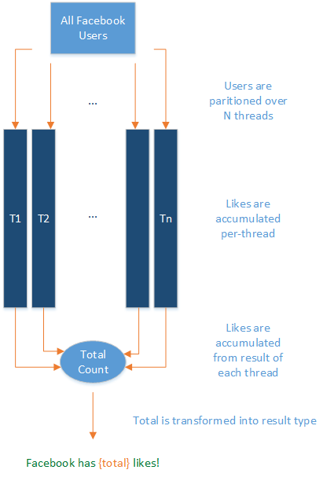

# LINQ (Language Integrated Query)

## What is it?

LINQ provides language-level querying capabilities and a [higher-order function](https://en.wikipedia.org/wiki/Higher-order_function) API to C# and VB as a way to write expressive, declarative code.

Language-level query syntax:

```csharp
var linqExperts = from p in programmers
                  where p.IsNewToLINQ
                  select new LINQExpert(p);
```

Same example using the `IEnumerable<T>` API:

```csharp
var linqExperts = programmers.Where(p => IsNewToLINQ)
                             .Select(p => new LINQExpert(p));
```

## LINQ is Expressive

Imagine you have a list of pets, but want to convert it into a dictionary where you can access a pet directly by its `RFID` value.

Traditional imperative code:

```csharp
var petLookup = new Dictionary<int, Pet>();

foreach (var pet in pets)
{
    petLookup.Add(pet.RFID, pet);
}
```

The intention behind the code is not to create a new `Dictionary<int, Pet>` and add to it via a loop, it is to convert an existing list into a dictionary! LINQ preserves the intention whereas the imperative code does not.

Equivalent LINQ expression:

```csharp
var petLookup = pets.ToDictionary(pet => pet.RFID);
```

The code using LINQ is valuable because it evens the playing field between intent and code when reasoning as a programmer. Another bonus is code brevity. Imagine reducing large portions of a codebase by 1/3 as done above. Pretty sweet deal, right?

## LINQ Providers Simplify Data Access

For a significant chunk of software out in the wild, everything revolves around dealing with data from some source (Databases, JSON, XML, etc). Often this involves learning a new API for each data source, which can be annoying. LINQ simplifies this by abstracting common elements of data access into a query syntax which looks the same no matter which data source you pick.

Consider the following: finding all XML elements with a specific attribute value.

```csharp
public static IEnumerable<XElement> FindAllElementsWithAttribute(XElement documentRoot, string elementName,
                                           string attributeName, string value)
{
    return from el in documentRoot.Elements(elementName)
           where (string)el.Element(attributeName) == value
           select el;
}
```

Writing code to manually traverse the XML document to perform this task would be far more challenging.

Interacting with XML isn’t the only thing you can do with LINQ Providers. [Linq to SQL](../../docs/framework/data/adonet/sql/linq/index.md) is a fairly bare-bones Object-Relational Mapper (ORM) for an MSSQL Server Database. The [JSON.NET](https://www.newtonsoft.com/json/help/html/LINQtoJSON.htm) library provides efficient JSON Document traversal via LINQ. Furthermore, if there isn’t a library which does what you need, you can also [write your own LINQ Provider](https://msdn.microsoft.com/library/Bb546158.aspx)!

## Why Use the Query Syntax?

This is a question which often comes up. After all, this,

```csharp
var filteredItems = myItems.Where(item => item.Foo);
```

is a lot more concise than this:

```csharp
var filteredItems = from item in myItems
                    where item.Foo
                    select item;
```

Isn’t the API syntax just a more concise way to do the query syntax?

No. The query syntax allows for the use the **let** clause, which allows you to introduce and bind a variable within the scope of the expression, using it in subsequent pieces of the expression. Reproducing the same code with only the API syntax can be done, but will most likely lead to code which is hard to read.

So this begs the question, **should you just use the query syntax?**

The answer to this question is **yes** if...

*   Your existing codebase already uses the query syntax
*   You need to scope variables within your queries due to complexity
*   You prefer the query syntax and it won’t distract from your codebase

The answer to this question is **no** if...

*   Your existing codebase already uses the API syntax
*   You have no need to scope variables within your queries
*   You prefer the API syntax and it won’t distract from your codebase

## Essential Samples

For a truly comprehensive list of LINQ samples, visit [101 LINQ Samples](https://code.msdn.microsoft.com/101-LINQ-Samples-3fb9811b).

The following is a quick demonstration of some of the essential pieces of LINQ. This is in no way comprehensive, as LINQ provides significantly more functionality than what is showcased here.

*   The bread and butter - `Where`, `Select`, and `Aggregate`:

```csharp
// Filtering a list
var germanShepards = dogs.Where(dog => dog.Breed == DogBreed.GermanShepard);

// Using the query syntax
var queryGermanShepards = from dog in dogs
                          where dog.Breed == DogBreed.GermanShepard
                          select dog;

// Mapping a list from type A to type B
var cats = dogs.Select(dog => dog.TurnIntoACat());

// Using the query syntax
var queryCats = from dog in dogs
                select dog.TurnIntoACat();

// Summing the lengths of a set of strings
int seed = 0;
int sumOfStrings = strings.Aggregate(seed, (s1, s2) => s1.Length + s2.Length);
```

*   Flattening a list of lists:

```csharp
// Transforms the list of kennels into a list of all their dogs.
var allDogsFromKennels = kennels.SelectMany(kennel => kennel.Dogs);
```

*   Union between two sets (with custom comparator):

```csharp
public class DogHairLengthComparer : IEqualityComparer<Dog>
{
    public bool Equals(Dog a, Dog b)
    {
        if (a == null && b == null)
        {
            return true;
        }
        else if ((a == null && b != null) ||
                 (a != null && b == null))
        {
            return false;
        }
        else
        {
            return a.HairLengthType == b.HairLengthType;
        }
    }

    public int GetHashCode(Dog d)
    {
        // default hashcode is enough here, as these are simple objects.
        return b.GetHashCode();
    }
}

...

// Gets all the short-haired dogs between two different kennels
var allShortHairedDogs = kennel1.Dogs.Union(kennel2.Dogs, new DogHairLengthComparer());
```

*   Intersection between two sets:

```csharp
// Gets the volunteers who spend share time with two humane societies.
var volunteers = humaneSociety1.Volunteers.Intersect(humaneSociety2.Volunteers,
                                                     new VolunteerTimeComparer());
```

*   Ordering:

```csharp
// Get driving directions, ordering by if it's toll-free before estimated driving time.
var results = DirectionsProcessor.GetDirections(start, end)
              .OrderBy(direction => direction.HasNoTolls)
              .ThenBy(direction => direction.EstimatedTime);
```

*   Finally, a more advanced sample: determining if the values of the properties of two instances of the same type are equal (Borrowed and modified from [this StackOverflow post](http://stackoverflow.com/a/844855)):

```csharp
public static bool PublicInstancePropertiesEqual<T>(this T self, T to, params string[] ignore) where T : class
{
    if (self != null && to != null)
    {
        var type = typeof(T);
        var ignoreList = new List<string>(ignore);

        // Selects the properties which have unequal values into a sequence of those properties.
        var unequalProperties = from pi in type.GetProperties(BindingFlags.Public | BindingFlags.Instance)
                                where !ignoreList.Contains(pi.Name)
                                let selfValue = type.GetProperty(pi.Name).GetValue(self, null)
                                let toValue = type.GetProperty(pi.Name).GetValue(to, null)
                                where selfValue != toValue && (selfValue == null || !selfValue.Equals(toValue))
                                select new { Prop = pi.Name, selfValue, toValue };
        return !unequalProperties.Any();
    }

    return self == to;
}
```

## PLINQ

PLINQ, or Parallel LINQ, is a parallel execution engine for LINQ expressions. In other words, a regular LINQ expressions can be trivially parallelized across any number of threads. This is accomplished via a call to `AsParallel()` preceding the expression.

Consider the following:

```csharp
public static string GetAllFacebookUserLikesMessage(IEnumerable<FacebookUser> facebookUsers)
{
    var seed = default(UInt64);

    Func<UInt64, UInt64, UInt64> threadAccumulator = (t1, t2) => t1 + t2;
    Func<UInt64, UInt64, UInt64> threadResultAccumulator = (t1, t2) => t1 + t2;
    Func<Uint64, string> resultSelector = total => $"Facebook has {total} likes!";

    return facebookUsers.AsParallel()
                        .Aggregate(seed, threadAccumulator, threadResultAccumulator, resultSelector);
}
```

This code will partition `facebookUsers` across system threads as necessary, sum up the total likes on each thread in parallel, sum the results computed by each thread, and project that result into a nice string.

In diagram form:



Parallelizable CPU-bound jobs which can be easily expressed via LINQ (in other words, are pure functions and have no side effects) are a great candidate for PLINQ. For jobs which _do_ have a side effect, consider using the [Task Parallel Library](./parallel-programming/task-parallel-library-tpl.md).

## Further Resources:

*   [101 LINQ Samples](https://code.msdn.microsoft.com/101-LINQ-Samples-3fb9811b)
*   [Linqpad](https://www.linqpad.net/), a playground environment and Database querying engine for C#/F#/VB
*   [EduLinq](https://codeblog.jonskeet.uk/2011/02/23/reimplementing-linq-to-objects-part-45-conclusion-and-list-of-posts/), an e-book for learning how LINQ-to-objects is implemented
