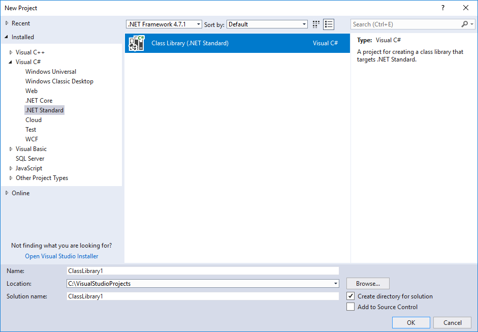
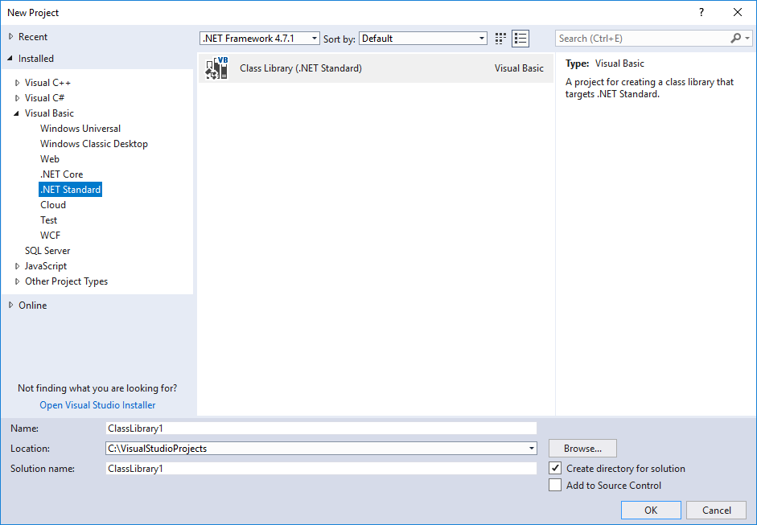

# What's new in .NET Standard

.NET Standard is a formal specification that defines a versioned set of APIs that must be available on .NET implementations that comply with that version of the standard. .NET Standard is targeted at library developers. A library that targets a .NET Standard version can be used on any .NET or Xamarin implementation that supports that version of the standard.

.NET Standard is included with the .NET SDK. It's also included with Visual Studio if you select the .NET workload.

.NET Standard 2.1 is the last version of .NET Standard that will be released. For more information, see [.NET 5+ and .NET Standard](../net-standard.md#net-5-and-net-standard).

## Supported .NET implementations

.NET Standard 2.1 is supported by the following .NET implementations:

- .NET Core 3.0 or later (including .NET 5 and later)
- Mono 6.4 or later
- Xamarin.iOS 12.16 or later
- Xamarin.Android 10.0 or later

.NET Standard 2.0 is supported by the following .NET implementations:

- .NET Core 2.0 or later (including .NET 5 and later)
- .NET Framework 4.6.1 or later
- Mono 5.4 or later
- Xamarin.iOS 10.14 or later
- Xamarin.Mac 3.8 or later
- Xamarin.Android 8.0 or later
- Universal Windows Platform 10.0.16299 or later

## What's new in .NET Standard 2.1

.NET Standard 2.1 adds many APIs to the standard. Some of them are new APIs, and others are existing APIs that help to converge the .NET implementations even further. For a list of the APIs that have been added to .NET Standard 2.1, see [.NET Standard 2.1 vs 2.0](https://github.com/dotnet/standard/blob/master/docs/versions/netstandard2.1_diff.md).

For more information, see the [Announcing .NET Standard 2.1](https://devblogs.microsoft.com/dotnet/announcing-net-standard-2-1/) blog post.

## What's new in .NET Standard 2.0

.NET Standard 2.0 includes the following new features.

### A vastly expanded set of APIs

Through version 1.6, .NET Standard included a comparatively small subset of APIs. Among those excluded were many APIs that were commonly used in .NET Framework or Xamarin. This complicates development, since it requires that developers find suitable replacements for familiar APIs when they develop applications and libraries that target multiple .NET implementations. .NET Standard 2.0 addresses this limitation by adding over 20,000 more APIs than were available in .NET Standard 1.6, the previous version of the standard. For a list of the APIs that have been added to .NET Standard 2.0, see [.NET Standard 2.0 vs 1.6](https://raw.githubusercontent.com/dotnet/standard/master/docs/versions/netstandard2.0_diff.md).

Some of the additions to the <xref:System> namespace in .NET Standard 2.0 include:

- Support for the <xref:System.AppDomain> class.
- Better support for working with arrays from additional members in the <xref:System.Array> class.
- Better support for working with attributes from additional members in the <xref:System.Attribute> class.
- Better calendar support and additional formatting options for <xref:System.DateTime> values.
- Additional <xref:System.Decimal> rounding functionality.
- Additional functionality in the <xref:System.Environment> class.
- Enhanced control over the garbage collector through the <xref:System.GC> class.
- Enhanced support for string comparison, enumeration, and normalization in the <xref:System.String> class.
- Support for daylight saving adjustments and transition times in the <xref:System.TimeZoneInfo.AdjustmentRule> and <xref:System.TimeZoneInfo.TransitionTime> classes.
- Significantly enhanced functionality in the <xref:System.Type> class.
- Better support for deserialization of exception objects by adding an exception constructor with <xref:System.Runtime.Serialization.SerializationInfo> and <xref:System.Runtime.Serialization.StreamingContext> parameters.

### Support for .NET Framework libraries

Many libraries target .NET Framework rather than .NET Standard. However, most of the calls in those libraries are to APIs that are included in .NET Standard 2.0. Starting with .NET Standard 2.0, you can access .NET Framework libraries from a .NET Standard library by using a [compatibility shim](https://github.com/dotnet/standard/blob/master/docs/planning/netstandard-2.0/README.md#assembly-unification). This compatibility layer is transparent to developers; you don't have to do anything to take advantage of .NET Framework libraries.

The single requirement is that the APIs called by the .NET Framework class library must be included in .NET Standard 2.0.

### Support for Visual Basic

You can now develop .NET Standard libraries in Visual Basic. Visual Studio 2019 and Visual Studio 2017 version 15.3 or later with the .NET Core workload installed include a .NET Standard Class Library template. For Visual Basic developers who use other development tools and environments, you can use the [dotnet new](../../core/tools/dotnet-new.md) command to create a .NET Standard Library project. For more information, see the [Tooling support for .NET Standard libraries](#tooling-support-for-net-standard-libraries).

### Tooling support for .NET Standard libraries

With the release of .NET Core 2.0 and .NET Standard 2.0, both Visual Studio 2017 and the [.NET CLI](../../core/tools/index.md) include tooling support for creating .NET Standard libraries.

If you install Visual Studio with the **.NET Core cross-platform development** workload, you can create a .NET Standard 2.0 library project by using a project template, as the following figure shows:

<!-- markdownlint-disable MD025 -->

# [C#](#tab/csharp)



If you're using the .NET CLI, the following [dotnet new](../../core/tools/dotnet-new.md) command creates a class library project that targets .NET Standard 2.0:

```dotnetcli
dotnet new classlib
```

# [Visual Basic](#tab/vb)



If you're using the .NET CLI, the following [dotnet new](../../core/tools/dotnet-new.md) command creates a class library project that targets .NET Standard 2.0:

```dotnetcli
dotnet new classlib -lang vb
```

---

## See also

- [.NET Standard](../net-standard.md)
- [Introducing .NET Standard](https://devblogs.microsoft.com/dotnet/introducing-net-standard/)
- [Download the .NET SDK](https://dotnet.microsoft.com/download)
