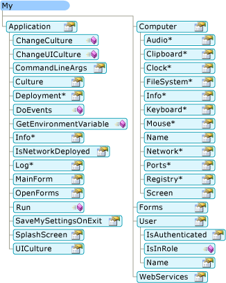
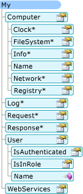

# How My Depends on Project Type (Visual Basic)
`My` exposes only those objects required by a particular project type. For example, the `My.Forms` object is available in a Windows Forms application but not available in a console application. This topic describes which `My` objects are available in different project types.  
  
## My in Windows Applications and Web Sites  
 `My` exposes only objects that are useful in the current project type; it suppresses objects that are not applicable. For example, the following image shows the `My` object model in a Windows Forms project.  
  
   
  
 In a Web site project, `My` exposes objects that are relevant to a Web developer (such as the `My.Request` and `My.Response` objects) while suppressing objects that are not relevant (such as the `My.Forms` object). The following image shows the `My` object model in a Web site project:  
  
   
  
## Project Details  
 The following table shows which `My` objects are enabled by default for eight project types: Windows application, class Library, console application, Windows control library, Web control library, Windows service, empty, and Web site.  
  
 There are three versions of the `My.Application` object, two versions of the `My.Computer` object, and two versions of `My.User` object; details about these versions are given in the footnotes after the table.  
  
|My Object|Windows Application|Class Library|Console Application|Windows Control Library|Web Control Library|Windows Service|Empty|Web Site|  
|---|---|---|---|---|---|---|---|---|  
|`My.Application`|**Yes** 1|**Yes** 2|**Yes** 3|**Yes** 2|No|**Yes** 3|No|No|  
|`My.Computer`|**Yes** 4|**Yes** 4|**Yes** 4|**Yes** 4|**Yes** 5|**Yes** 4|No|**Yes** 5|  
|`My.Forms`|**Yes**|No|No|**Yes**|No|No|No|No|  
|`My.Log`|No|No|No|No|No|No|No|**Yes**|  
|`My.Request`|No|No|No|No|No|No|No|**Yes**|  
|`My.Resources`|**Yes**|**Yes**|**Yes**|**Yes**|**Yes**|**Yes**|No|No|  
|`My.Response`|No|No|No|No|No|No|No|**Yes**|  
|`My.Settings`|**Yes**|**Yes**|**Yes**|**Yes**|**Yes**|**Yes**|No|No|  
|`My.User`|**Yes** 6|**Yes** 6|**Yes** 6|**Yes** 6|**Yes** 7|**Yes** 6|No|**Yes** 7|  
|`My.WebServices`|**Yes**|**Yes**|**Yes**|**Yes**|**Yes**|**Yes**|No|No|  
  
 1 Windows Forms version of `My.Application`. Derives from the console version (see Note 3); adds support for interacting with the application's windows and provides the [!INCLUDE[vbprvb](~/includes/vbprvb-md.md)] Application model.  
  
 2 Library version of `My.Application`. Provides the basic functionality needed by an application: provides members for writing to the application log and accessing application information.  
  
 3 Console version of `My.Application`. Derives from the library version (see Note 2), and adds additional members for accessing the application's command-line arguments and ClickOnce deployment information.  
  
 4 Windows version of `My.Computer`. Derives from the Server version (see Note 5), and provides access to useful objects on a client machine, such as the keyboard, screen, and mouse.  
  
 5 Server version of `My.Computer`. Provides basic information about the computer, such as the name, access to the clock, and so on.  
  
 6 Windows version of `My.User`. This object is associated with the thread's current identity.  
  
 7 Web version of `My.User`. This object is associated with the user identity of the application's current HTTP request.  
  
## See Also  
 <xref:Microsoft.VisualBasic.ApplicationServices.ApplicationBase>  
 <xref:Microsoft.VisualBasic.Devices.Computer>  
 <xref:Microsoft.VisualBasic.Logging.Log>  
 <xref:Microsoft.VisualBasic.ApplicationServices.User>  
 [Customizing Which Objects are Available in My](../../../visual-basic/developing-apps/customizing-extending-my/customizing-which-objects-are-available-in-my.md)  
 [Conditional Compilation](../../../visual-basic/programming-guide/program-structure/conditional-compilation.md)  
 [/define (Visual Basic)](../../../visual-basic/reference/command-line-compiler/define.md)  
 [My.Forms Object](../../../visual-basic/language-reference/objects/my-forms-object.md)  
 [My.Request Object](../../../visual-basic/language-reference/objects/my-request-object.md)  
 [My.Response Object](../../../visual-basic/language-reference/objects/my-response-object.md)  
 [My.WebServices Object](../../../visual-basic/language-reference/objects/my-webservices-object.md)
