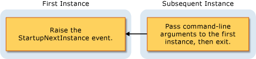

# Overview of the Visual Basic Application Model
[!INCLUDE[vbprvb](~/includes/vbprvb-md.md)] provides a well-defined model for controlling the behavior of Windows Forms applications: the [!INCLUDE[vbprvb](~/includes/vbprvb-md.md)] Application model. This model includes events for handling the application's startup and shutdown, as well as events for catching unhandled exceptions. It also provides support for developing single-instance applications. The application model is extensible, so developers that need more control can customize its overridable methods.  
  
## Uses for the Application Model  
 A typical application needs to perform tasks when it starts up and shuts down. For example, when it starts up, the application can display a splash screen, make database connections, load a saved state, and so on. When the application shuts down, it can close database connections, save the current state, and so on. In addition, the application can execute specific code when the application shuts down unexpectedly, such as during an unhandled exception.  
  
 The [!INCLUDE[vbprvb](~/includes/vbprvb-md.md)] Application model makes it easy to create a *single-instance* application. A single-instance application differs from a normal application in that only one instance of the application can be running at a time. An attempt to launch another instance of a single-instance application results in the original instance being notified—by means of the `StartupNextInstance` event—that another launch attempt was made. The notification includes the subsequent instance's command-line arguments. The subsequent instance of the application is then closed before any initialization can occur.  
  
 A single-instance application starts and checks whether it is the first instance or a subsequent instance of the application:  
  
-   If it is the first instance, it starts as usual.  
  
-   Each subsequent attempt to start the application, while the first instance runs, results in very different behavior. The subsequent attempt notifies the first instance about the command-line arguments, and then immediately exits. The first instance handles the `StartupNextInstance` event to determine what the subsequent instance's command-line arguments were, and continues to run.  
  
     This diagram shows how a subsequent instance signals the first instance.  
  
       
  
 By handling the `StartupNextInstance` event, you can control how your single-instance application behaves. For example, Microsoft Outlook typically runs as a single-instance application; when Outlook is running and you attempt to start Outlook again, focus shifts to the original instance but another instance does not open.  
  
## Events in the Application Model  
 The following events are found in the application model:  
  
-   **Application startup**. The application raises the <xref:Microsoft.VisualBasic.ApplicationServices.WindowsFormsApplicationBase.Startup> event when it starts. By handling this event, you can add code that initializes the application before the main form is loaded. The `Startup` event also provides for canceling execution of the application during that phase of the startup process, if desired.  
  
     You can configure the application to show a splash screen while the application startup code runs. By default, the application model suppresses the splash screen when either the `/nosplash` or `-nosplash` command-line argument is used.  
  
-   **Single-instance applications**. The <xref:Microsoft.VisualBasic.ApplicationServices.WindowsFormsApplicationBase.StartupNextInstance> event is raised when a subsequent instance of a single-instance application starts. The event passes the command-line arguments of the subsequent instance.  
  
-   **Unhandled exceptions**. If the application encounters an unhandled exception, it raises the <xref:Microsoft.VisualBasic.ApplicationServices.WindowsFormsApplicationBase.UnhandledException> event. Your handler for that event can examine the exception and determine whether to continue execution.  
  
     The `UnhandledException` event is not raised in some circumstances. For more information, see <xref:Microsoft.VisualBasic.ApplicationServices.WindowsFormsApplicationBase.UnhandledException>.  
  
-   **Network-connectivity changes**. If the computer's network availability changes, the application raises the <xref:Microsoft.VisualBasic.ApplicationServices.WindowsFormsApplicationBase.NetworkAvailabilityChanged> event.  
  
     The `NetworkAvailabilityChanged` event is not raised in some circumstances. For more information, see <xref:Microsoft.VisualBasic.ApplicationServices.WindowsFormsApplicationBase.NetworkAvailabilityChanged>.  
  
-   **Application shut down**. The application provides the <xref:Microsoft.VisualBasic.ApplicationServices.WindowsFormsApplicationBase.Shutdown> event to signal when it is about to shut down. In that event handler, you can make sure that the operations your application needs to perform—closing and saving, for example—are completed. You can configure your application to shut down when the main form closes, or to shut down only when all forms close.  
  
## Availability  
 By default, the [!INCLUDE[vbprvb](~/includes/vbprvb-md.md)] Application model is available for Windows Forms projects. If you configure the application to use a different startup object, or start the application code with a custom `Sub Main`, then that object or class may need to provide an implementation of the <xref:Microsoft.VisualBasic.ApplicationServices.WindowsFormsApplicationBase> class to use the application model. For information about changing the startup object, see [Application Page, Project Designer (Visual Basic)](/visualstudio/ide/reference/application-page-project-designer-visual-basic).  
  
## See Also  
 <xref:Microsoft.VisualBasic.ApplicationServices.WindowsFormsApplicationBase>  
 <xref:Microsoft.VisualBasic.ApplicationServices.WindowsFormsApplicationBase.Startup>  
 <xref:Microsoft.VisualBasic.ApplicationServices.WindowsFormsApplicationBase.StartupNextInstance>  
 <xref:Microsoft.VisualBasic.ApplicationServices.WindowsFormsApplicationBase.UnhandledException>  
 <xref:Microsoft.VisualBasic.ApplicationServices.WindowsFormsApplicationBase.Shutdown>  
 <xref:Microsoft.VisualBasic.ApplicationServices.WindowsFormsApplicationBase.NetworkAvailabilityChanged>  
 <xref:Microsoft.VisualBasic.ApplicationServices.WindowsFormsApplicationBase>  
 [Extending the Visual Basic Application Model](../../../visual-basic/developing-apps/customizing-extending-my/extending-the-visual-basic-application-model.md)
