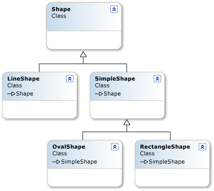

# Introduction to the Line and Shape Controls (Visual Studio)
The Visual Basic Power Packs Line and Shape controls are a set of three graphical controls that enable you to draw lines and shapes on forms and containers. The <xref:Microsoft.VisualBasic.PowerPacks.LineShape> control is used to draw horizontal, vertical, and diagonal lines. The <xref:Microsoft.VisualBasic.PowerPacks.OvalShape> control is used to draw circles and ovals, and the <xref:Microsoft.VisualBasic.PowerPacks.RectangleShape> control is used to draw rectangles and squares.  
  
## Line and Shape Controls  
 Line and Shape controls encapsulate many of the graphics methods that are contained in the <xref:System.Drawing> namespace. This enables you to draw lines and shapes in a single step without having to create graphics objects, pens, and brushes. Complex graphics techniques such as gradient fills can be accomplished by just setting some properties.  
  
 Although it is also possible to draw lines and shapes by using graphics methods, there are several advantages to using the Line and Shape controls:  
  
-   Graphics methods can be called only at run time. Line and Shape controls can be added to a form at design time. This enables you to see what they look like and to position them exactly; they can also be added at run time.  
  
-   Line and Shape controls are selectable at run time, providing events such as <xref:Microsoft.VisualBasic.PowerPacks.Shape.Click> and <xref:Microsoft.VisualBasic.PowerPacks.Shape.OnDoubleClick%2A>. The outputs of graphics methods are not selectable and do not provide events.  
  
-   Line and Shape controls provide <xref:Microsoft.VisualBasic.PowerPacks.Shape.BringToFront%2A> and <xref:Microsoft.VisualBasic.PowerPacks.Shape.SendToBack%2A> methods that enable you to control their z-order at design time and at run time. The z-order of graphics methods can be controlled only by changing their order of execution at run time.  
  
-   Line and Shape controls are windowless controls; they have no window handles and therefore use less system resources.  
  
### Object Model  
 Line and Shape controls derive from a base <xref:Microsoft.VisualBasic.PowerPacks.Shape> class that defines their shared properties, methods, and events.  
  
 The following illustration shows the Line and Shape object hierarchy.  
  
   
Line and Shape object hierarchy  
  
 The derived <xref:Microsoft.VisualBasic.PowerPacks.LineShape> class contains properties, methods, and events that are unique to lines. The derived <xref:Microsoft.VisualBasic.PowerPacks.SimpleShape> class is the base class for <xref:Microsoft.VisualBasic.PowerPacks.OvalShape> and <xref:Microsoft.VisualBasic.PowerPacks.RectangleShape>; it contains properties, methods, and events common to all shapes. You can also derive from <xref:Microsoft.VisualBasic.PowerPacks.SimpleShape> to create your own `Shape` controls.  
  
 The <xref:Microsoft.VisualBasic.PowerPacks.OvalShape> and <xref:Microsoft.VisualBasic.PowerPacks.RectangleShape> classes can be used to draw circles, ovals, rectangles, and rectangles with rounded corners.  
  
 When a Line or Shape control is added to a form or container, an invisible <xref:Microsoft.VisualBasic.PowerPacks.ShapeContainer> object is created. The <xref:Microsoft.VisualBasic.PowerPacks.ShapeContainer> acts as a canvas for the shapes within each container control; each <xref:Microsoft.VisualBasic.PowerPacks.ShapeContainer> has a corresponding <xref:Microsoft.VisualBasic.PowerPacks.ShapeCollection> that enables you to iterate through the Line and Shape controls. You can move shapes from one container to another by using cut and paste or by dragging and dropping. When the last shape is removed from a container, the <xref:Microsoft.VisualBasic.PowerPacks.ShapeContainer> is removed also.  
  
> [!NOTE]
>  Not all container controls support the Line and Shape controls. You cannot host a Line or Shape control on a <xref:System.Windows.Forms.TableLayoutPanel> or a <xref:System.Windows.Forms.FlowLayoutPanel>.  
  
## See Also  
 <xref:Microsoft.VisualBasic.PowerPacks>  
 [How to: Draw Lines with the LineShape Control](../../../visual-basic/developing-apps/windows-forms/how-to-draw-lines-with-the-lineshape-control-visual-studio.md)  
 [How to: Draw Shapes with the OvalShape and RectangleShape Controls](../../../visual-basic/developing-apps/windows-forms/how-to-draw-shapes-with-the-ovalshape-and-rectangleshape-controls.md)  
 [How to: Enable Tabbing Between Shapes](../../../visual-basic/developing-apps/windows-forms/how-to-enable-tabbing-between-shapes-visual-studio.md)
