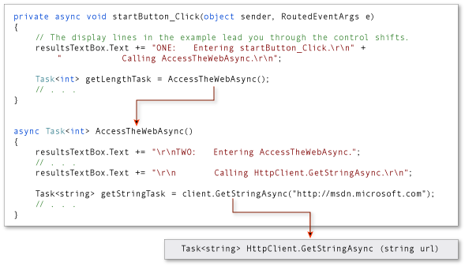
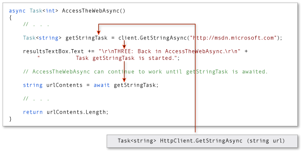
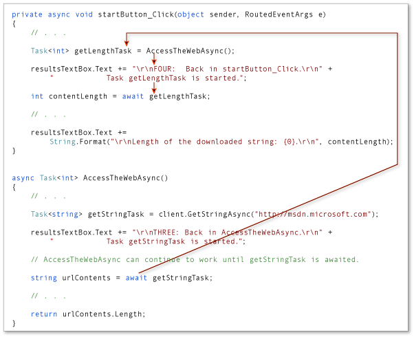
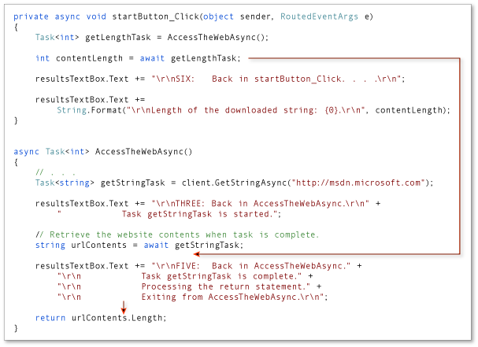
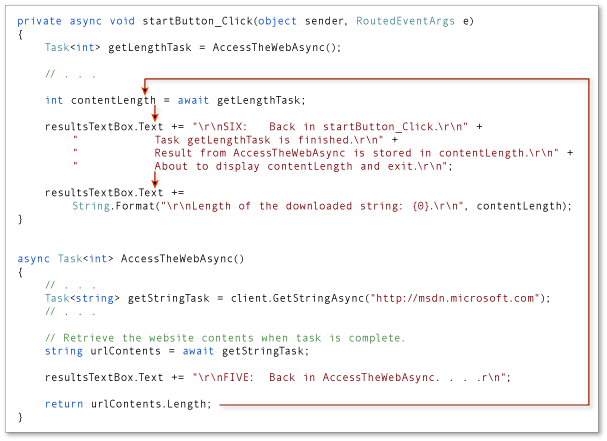

# Control Flow in Async Programs (Visual Basic)
You can write and maintain asynchronous programs more easily by using the `Async` and `Await` keywords. However, the results might surprise you if you don't understand how your program operates. This topic traces the flow of control through a simple async program to show you when control moves from one method to another and what information is transferred each time.  
  
> [!NOTE]
>  The `Async` and `Await` keywords were introduced in Visual Studio 2012.  
  
 In general, you mark methods that contain asynchronous code with the [Async](../../../../visual-basic/language-reference/modifiers/async.md) modifier. In a method that's marked with an async modifier, you can use an [Await (Visual Basic)](../../../../visual-basic/language-reference/operators/await-operator.md) operator to specify where the method pauses to wait for a called asynchronous process to complete. For more information, see [Asynchronous Programming with Async and Await (Visual Basic)](../../../../visual-basic/programming-guide/concepts/async/index.md).  
  
 The following example uses async methods to download the contents of a specified website as a string and to display the length of the string. The example contains the following two methods.  
  
-   `startButton_Click`, which calls `AccessTheWebAsync` and displays the result.  
  
-   `AccessTheWebAsync`, which downloads the contents of a website as a string and returns the length of the string. `AccessTheWebAsync` uses an asynchronous <xref:System.Net.Http.HttpClient> method, <xref:System.Net.Http.HttpClient.GetStringAsync%28System.String%29>, to download the contents.  
  
 Numbered display lines appear at strategic points throughout the program to help you understand how the program runs and to explain what happens at each point that is marked. The display lines are labeled "ONE" through "SIX." The labels represent the order in which the program reaches these lines of code.  
  
 The following code shows an outline of the program.  
  
```vb  
Class MainWindow  
  
    Private Async Sub StartButton_Click(sender As Object, e As RoutedEventArgs) Handles StartButton.Click  
  
        ' ONE  
        Dim getLengthTask As Task(Of Integer) = AccessTheWebAsync()  
  
        ' FOUR  
        Dim contentLength As Integer = Await getLengthTask  
  
        ' SIX  
        ResultsTextBox.Text &=  
            String.Format(vbCrLf & "Length of the downloaded string: {0}." & vbCrLf, contentLength)  
  
    End Sub  
  
    Async Function AccessTheWebAsync() As Task(Of Integer)  
  
        ' TWO  
        Dim client As HttpClient = New HttpClient()   
        Dim getStringTask As Task(Of String) =   
            client.GetStringAsync("http://msdn.microsoft.com")  
  
        ' THREE  
        Dim urlContents As String = Await getStringTask  
  
        ' FIVE  
        Return urlContents.Length  
    End Function  
  
End Class  
```  
  
 Each of the labeled locations, "ONE" through "SIX," displays information about the current state of the program. The following output is produced.  
  
```  
ONE:   Entering startButton_Click.  
           Calling AccessTheWebAsync.  
  
TWO:   Entering AccessTheWebAsync.  
           Calling HttpClient.GetStringAsync.  
  
THREE: Back in AccessTheWebAsync.  
           Task getStringTask is started.  
           About to await getStringTask & return a Task<int> to startButton_Click.  
  
FOUR:  Back in startButton_Click.  
           Task getLengthTask is started.  
           About to await getLengthTask -- no caller to return to.  
  
FIVE:  Back in AccessTheWebAsync.  
           Task getStringTask is complete.  
           Processing the return statement.  
           Exiting from AccessTheWebAsync.  
  
SIX:   Back in startButton_Click.  
           Task getLengthTask is finished.  
           Result from AccessTheWebAsync is stored in contentLength.  
           About to display contentLength and exit.  
  
Length of the downloaded string: 33946.  
```  
  
## Set Up the Program  
 You can download the code that this topic uses from MSDN, or you can build it yourself.  
  
> [!NOTE]
>  To run the example, you must have Visual Studio 2012 or newer and  the .NET Framework 4.5 or newer installed on your computer.  
  
### Download the Program  
 You can download the application for this topic from [Async Sample: Control Flow in Async Programs](http://go.microsoft.com/fwlink/?LinkId=255285). The following steps open and run the program.  
  
1.  Unzip the downloaded file, and then start Visual Studio.  
  
2.  On the menu bar, choose **File**, **Open**, **Project/Solution**.  
  
3.  Navigate to the folder that holds the unzipped sample code, open the solution (.sln) file, and then choose the F5 key to build and run the project.  
  
### Build the Program Yourself  
 The following Windows Presentation Foundation (WPF) project contains the code example for this topic.  
  
 To run the project, perform the following steps:  
  
1.  Start Visual Studio.  
  
2.  On the menu bar, choose **File**, **New**, **Project**.  
  
     The **New Project** dialog box opens.  
  
3.  In the **Installed Templates** pane, choose **Visual Basic**, and then choose **WPF Application** from the list of project types.  
  
4.  Enter `AsyncTracer` as the name of the project, and then choose the **OK** button.  
  
     The new project appears in **Solution Explorer**.  
  
5.  In the Visual Studio Code Editor, choose the **MainWindow.xaml** tab.  
  
     If the tab isn’t visible, open the shortcut menu for MainWindow.xaml in **Solution Explorer**, and then choose **View Code**.  
  
6.  In the **XAML** view of MainWindow.xaml, replace the code with the following code.  
  
    ```vb  
    <Window  
        xmlns="http://schemas.microsoft.com/winfx/2006/xaml/presentation"  
        xmlns:x="http://schemas.microsoft.com/winfx/2006/xaml"  
        xmlns:d="http://schemas.microsoft.com/expression/blend/2008" xmlns:mc="http://schemas.openxmlformats.org/markup-compatibility/2006" mc:Ignorable="d" x:Class="MainWindow"  
        Title="Control Flow Trace" Height="350" Width="525">  
        <Grid>  
            <Button x:Name="StartButton" Content="Start" HorizontalAlignment="Left" Margin="221,10,0,0" VerticalAlignment="Top" Width="75"/>  
            <TextBox x:Name="ResultsTextBox" HorizontalAlignment="Left" TextWrapping="Wrap" VerticalAlignment="Bottom" Width="510" Height="265" FontFamily="Lucida Console" FontSize="10" VerticalScrollBarVisibility="Visible" d:LayoutOverrides="HorizontalMargin"/>  
  
        </Grid>  
    </Window>  
    ```  
  
     A simple window that contains a text box and a button appears in the **Design** view of MainWindow.xaml.  
  
7.  Add a reference for <xref:System.Net.Http>.  
  
8.  In **Solution Explorer**, open the shortcut menu for MainWindow.xaml.vb, and then choose **View Code**.  
  
9. In MainWindow.xaml.vb , replace the code with the following code.  
  
    ```vb  
    ' Add an Imports statement and a reference for System.Net.Http.  
    Imports System.Net.Http  
  
    Class MainWindow  
  
        Private Async Sub StartButton_Click(sender As Object, e As RoutedEventArgs) Handles StartButton.Click  
  
            ' The display lines in the example lead you through the control shifts.  
            ResultsTextBox.Text &= "ONE:   Entering StartButton_Click." & vbCrLf &  
                "           Calling AccessTheWebAsync." & vbCrLf  
  
            Dim getLengthTask As Task(Of Integer) = AccessTheWebAsync()  
  
            ResultsTextBox.Text &= vbCrLf & "FOUR:  Back in StartButton_Click." & vbCrLf &  
                "           Task getLengthTask is started." & vbCrLf &  
                "           About to await getLengthTask -- no caller to return to." & vbCrLf  
  
            Dim contentLength As Integer = Await getLengthTask  
  
            ResultsTextBox.Text &= vbCrLf & "SIX:   Back in StartButton_Click." & vbCrLf &  
                "           Task getLengthTask is finished." & vbCrLf &  
                "           Result from AccessTheWebAsync is stored in contentLength." & vbCrLf &  
                "           About to display contentLength and exit." & vbCrLf  
  
            ResultsTextBox.Text &=  
                String.Format(vbCrLf & "Length of the downloaded string: {0}." & vbCrLf, contentLength)  
        End Sub  
  
        Async Function AccessTheWebAsync() As Task(Of Integer)  
  
            ResultsTextBox.Text &= vbCrLf & "TWO:   Entering AccessTheWebAsync."  
  
            ' Declare an HttpClient object.  
            Dim client As HttpClient = New HttpClient()  
  
            ResultsTextBox.Text &= vbCrLf & "           Calling HttpClient.GetStringAsync." & vbCrLf  
  
            ' GetStringAsync returns a Task(Of String).   
            Dim getStringTask As Task(Of String) = client.GetStringAsync("http://msdn.microsoft.com")  
  
            ResultsTextBox.Text &= vbCrLf & "THREE: Back in AccessTheWebAsync." & vbCrLf &  
                "           Task getStringTask is started."  
  
            ' AccessTheWebAsync can continue to work until getStringTask is awaited.  
  
            ResultsTextBox.Text &=  
                vbCrLf & "           About to await getStringTask & return a Task(Of Integer) to StartButton_Click." & vbCrLf  
  
            ' Retrieve the website contents when task is complete.  
            Dim urlContents As String = Await getStringTask  
  
            ResultsTextBox.Text &= vbCrLf & "FIVE:  Back in AccessTheWebAsync." &  
                vbCrLf & "           Task getStringTask is complete." &  
                vbCrLf & "           Processing the return statement." &  
                vbCrLf & "           Exiting from AccessTheWebAsync." & vbCrLf  
  
            Return urlContents.Length  
        End Function  
  
    End Class  
    ```  
  
10. Choose the F5 key to run the program, and then choose the **Start** button.  
  
     The following output should appear.  
  
    ```  
    ONE:   Entering startButton_Click.  
               Calling AccessTheWebAsync.  
  
    TWO:   Entering AccessTheWebAsync.  
               Calling HttpClient.GetStringAsync.  
  
    THREE: Back in AccessTheWebAsync.  
               Task getStringTask is started.  
               About to await getStringTask & return a Task<int> to startButton_Click.  
  
    FOUR:  Back in startButton_Click.  
               Task getLengthTask is started.  
               About to await getLengthTask -- no caller to return to.  
  
    FIVE:  Back in AccessTheWebAsync.  
               Task getStringTask is complete.  
               Processing the return statement.  
               Exiting from AccessTheWebAsync.  
  
    SIX:   Back in startButton_Click.  
               Task getLengthTask is finished.  
               Result from AccessTheWebAsync is stored in contentLength.  
               About to display contentLength and exit.  
  
    Length of the downloaded string: 33946.  
    ```  
  
## Trace the Program  
  
### Steps ONE and TWO  
 The first two display lines trace the path as `startButton_Click` calls `AccessTheWebAsync`, and `AccessTheWebAsync` calls the asynchronous <xref:System.Net.Http.HttpClient> method <xref:System.Net.Http.HttpClient.GetStringAsync%28System.String%29>. The following image outlines the calls from method to method.  
  
   
  
 The return type of both `AccessTheWebAsync` and `client.GetStringAsync` is <xref:System.Threading.Tasks.Task%601>. For `AccessTheWebAsync`, TResult is an integer. For `GetStringAsync`, TResult is a string. For more information about async method return types, see [Async Return Types (Visual Basic)](../../../../visual-basic/programming-guide/concepts/async/async-return-types.md).  
  
 A task-returning async method returns a task instance when control shifts back to the caller. Control returns from an async method to its caller either when an `Await` operator is encountered in the called method or when the called method ends. The display lines that are labeled "THREE" through "SIX" trace this part of the process.  
  
### Step THREE  
 In `AccessTheWebAsync`, the asynchronous method <xref:System.Net.Http.HttpClient.GetStringAsync%28System.String%29> is called to download the contents of the target webpage. Control returns from `client.GetStringAsync` to `AccessTheWebAsync` when `client.GetStringAsync` returns.  
  
 The `client.GetStringAsync` method returns a task of string that’s assigned to the `getStringTask` variable in `AccessTheWebAsync`. The following line in the example program shows the call to `client.GetStringAsync` and the assignment.  
  
```vb  
Dim getStringTask As Task(Of String) = client.GetStringAsync("http://msdn.microsoft.com")  
```  
  
 You can think of the task as a promise by `client.GetStringAsync` to produce an actual string eventually. In the meantime, if `AccessTheWebAsync` has work to do that doesn't depend on the promised string from `client.GetStringAsync`, that work can continue while  `client.GetStringAsync` waits. In the example, the following lines of output, which are labeled "THREE," represent the opportunity to do independent work  
  
```  
THREE: Back in AccessTheWebAsync.  
           Task getStringTask is started.  
           About to await getStringTask & return a Task<int> to startButton_Click.  
```  
  
 The following statement suspends progress in `AccessTheWebAsync` when `getStringTask` is awaited.  
  
```vb  
Dim urlContents As String = Await getStringTask  
```  
  
 The following image shows the flow of control from `client.GetStringAsync` to the assignment to `getStringTask` and from the creation of `getStringTask` to the application of an Await operator.  
  
   
  
 The await expression suspends `AccessTheWebAsync` until `client.GetStringAsync` returns. In the meantime, control returns to the caller of `AccessTheWebAsync`, `startButton_Click`.  
  
> [!NOTE]
>  Typically, you await the call to an asynchronous method immediately. For example, the following assignment could replace the previous code that creates and then awaits `getStringTask`: `Dim urlContents As String = Await client.GetStringAsync("http://msdn.microsoft.com")`  
>   
>  In this topic, the await operator is applied later to accommodate the output lines that mark the flow of control through the program.  
  
### Step FOUR  
 The declared return type of `AccessTheWebAsync` is `Task(Of Integer)`. Therefore, when `AccessTheWebAsync` is suspended, it returns a task of integer to `startButton_Click`. You should understand that the returned task isn’t `getStringTask`. The returned task is a new task of integer that represents what remains to be done in the suspended method, `AccessTheWebAsync`. The task is a promise from `AccessTheWebAsync` to produce an integer when the task is complete.  
  
 The following statement assigns this task to the `getLengthTask` variable.  
  
```vb  
Dim getLengthTask As Task(Of Integer) = AccessTheWebAsync()  
```  
  
 As in `AccessTheWebAsync`, `startButton_Click` can continue with work that doesn’t depend on the results of the asynchronous task (`getLengthTask`) until the task is awaited. The following output lines represent that work.  
  
```  
FOUR:  Back in startButton_Click.  
           Task getLengthTask is started.  
           About to await getLengthTask -- no caller to return to.  
```  
  
 Progress in `startButton_Click` is suspended when `getLengthTask` is awaited. The following assignment statement suspends `startButton_Click` until `AccessTheWebAsync` is complete.  
  
```vb  
Dim contentLength As Integer = Await getLengthTask  
```  
  
 In the following illustration, the arrows show the flow of control from the await expression in `AccessTheWebAsync` to the assignment of a value to `getLengthTask`, followed by normal processing in `startButton_Click` until `getLengthTask` is awaited.  
  
   
  
### Step FIVE  
 When `client.GetStringAsync` signals that it’s complete, processing in `AccessTheWebAsync` is released from suspension and can continue past the await statement. The following lines of output represent the resumption of processing.  
  
```  
FIVE:  Back in AccessTheWebAsync.  
           Task getStringTask is complete.  
           Processing the return statement.  
           Exiting from AccessTheWebAsync.  
```  
  
 The operand of the return statement, `urlContents.Length`, is stored in the task that  `AccessTheWebAsync` returns. The await expression retrieves that value from `getLengthTask` in `startButton_Click`.  
  
 The following image shows the transfer of control after `client.GetStringAsync` (and `getStringTask`) are complete.  
  
   
  
 `AccessTheWebAsync` runs to completion, and control returns to `startButton_Click`, which is awaiting the completion.  
  
### Step SIX  
 When `AccessTheWebAsync` signals that it’s complete, processing can continue past the await statement in `startButton_Async`. In fact, the program has nothing more to do.  
  
 The following lines of output represent the resumption of processing in `startButton_Async`:  
  
```  
SIX:   Back in startButton_Click.  
           Task getLengthTask is finished.  
           Result from AccessTheWebAsync is stored in contentLength.  
           About to display contentLength and exit.  
```  
  
 The await expression retrieves from `getLengthTask` the integer value that’s the operand of the return statement in `AccessTheWebAsync`. The following statement assigns that value to the `contentLength` variable.  
  
```vb  
Dim contentLength As Integer = Await getLengthTask  
```  
  
 The following image shows the return of control from `AccessTheWebAsync` to `startButton_Click`.  
  
   
  
## See Also  
 [Asynchronous Programming with Async and Await (Visual Basic)](../../../../visual-basic/programming-guide/concepts/async/index.md)  
 [Async Return Types (Visual Basic)](../../../../visual-basic/programming-guide/concepts/async/async-return-types.md)  
 [Walkthrough: Accessing the Web by Using Async and Await (Visual Basic)](../../../../visual-basic/programming-guide/concepts/async/walkthrough-accessing-the-web-by-using-async-and-await.md)  
 [Async Sample: Control Flow in Async Programs (C# and Visual Basic)](http://go.microsoft.com/fwlink/?LinkId=255285)
