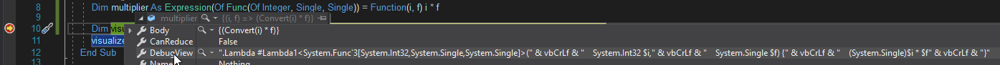
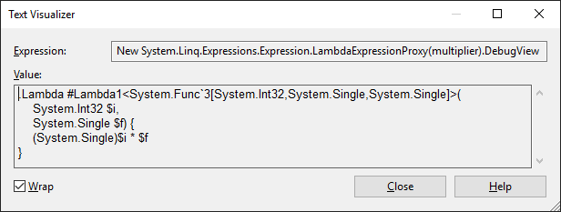
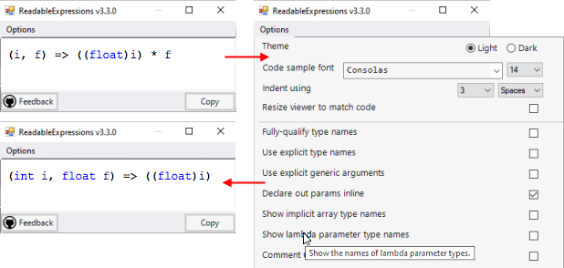
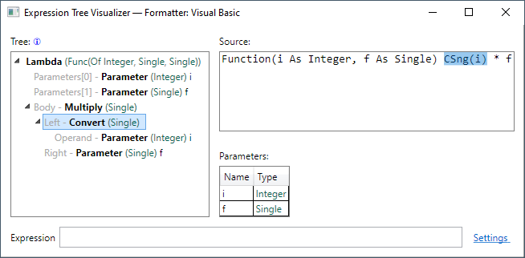
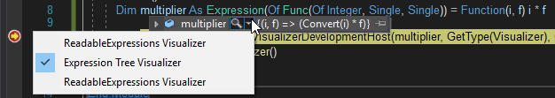

# Debugging Expression Trees in Visual Studio (Visual Basic)

You can analyze the structure and content of expression trees when you debug your applications. To get a quick overview of the expression tree structure, you can use the `DebugView` property, which represents expression trees [using a special syntax](debugview-syntax.md). (Note that `DebugView` is available only in debug mode.)

Since `DebugView` is a string, you can use the [built-in Text Visualizer](/visualstudio/debugger/view-strings-visualizer#open-a-string-visualizer) to view it across multiple lines, by selecting **Text Visualizer** from the magnifying glass icon next to the `DebugView` label.

 

Alternatively, you can install and use [a custom visualizer](/visualstudio/debugger/create-custom-visualizers-of-data) for expression trees, such as:

- [Readable Expressions](https://github.com/agileobjects/ReadableExpressions) ([MIT license](https://github.com/agileobjects/ReadableExpressions/blob/master/LICENCE.md), available at the [Visual Studio Marketplace](https://marketplace.visualstudio.com/items?itemName=vs-publisher-1232914.ReadableExpressionsVisualizers)), renders the expression tree as themeable C# code, with various rendering options:

  

- [Expression Tree Visualizer](https://github.com/zspitz/ExpressionTreeVisualizer/blob/master/README.md) ([MIT license](https://github.com/zspitz/ExpressionTreeVisualizer/blob/master/LICENSE)) provides a tree view of the expression tree and its individual nodes; and can render the expression tree using Visual Basic syntax:

  

### To open a visualizer for an expression tree

1. Click the magnifying glass icon that appears next to the expression tree in **DataTips**, a **Watch** window, the **Autos** window, or the **Locals** window.

    A list of available visualizers is displayed.:

    

2. Click the visualizer you want to use.

## See also

- [Expression Trees (Visual Basic)](index.md)
- [Debugging in Visual Studio](/visualstudio/debugger/debugger-feature-tour)
- [Create Custom Visualizers](/visualstudio/debugger/create-custom-visualizers-of-data)
- [`DebugView` syntax](debugview-syntax.md)
