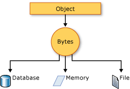

# Serialization (Visual Basic)

Serialization is the process of converting an object into a stream of bytes in order to store the object or transmit it to memory, a database, or a file. Its main purpose is to save the state of an object in order to be able to recreate it when needed. The reverse process is called deserialization.  
  
## How Serialization Works  

 This illustration shows the overall process of serialization.  
  

  
 The object is serialized to a stream, which carries not just the data, but information about the object's type, such as its version, culture, and assembly name. From that stream, it can be stored in a database, a file, or memory.  
  
### Uses for Serialization  

 Serialization allows the developer to save the state of an object and recreate it as needed, providing storage of objects as well as data exchange. Through serialization, a developer can perform actions like sending the object to a remote application by means of a Web Service, passing an object from one domain to another, passing an object through a firewall as an XML string, or maintaining security or user-specific information across applications.

## JSON serialization

The <xref:System.Text.Json> namespace contains classes for JavaScript Object Notation (JSON) serialization and deserialization. JSON is an open standard that is commonly used for sharing data across the web.

JSON serialization serializes the public properties of an object into a string, byte array, or stream that conforms to [the RFC 8259 JSON specification](https://tools.ietf.org/html/rfc8259). To control the way <xref:System.Text.Json.JsonSerializer> serializes or deserializes an instance of the class, you can use one or more of the following approaches:

* Use a <xref:System.Text.Json.JsonSerializerOptions> object
* Apply attributes from the <xref:System.Text.Json.Serialization> namespace to classes or properties
* [Customize the contract](../../../../standard/serialization/system-text-json/custom-contracts.md)
* [Implement custom converters](../../../../standard/serialization/system-text-json/converters-how-to.md)

## Binary and XML serialization

The <xref:System.Runtime.Serialization> namespace contains classes for binary and XML serialization and deserialization.

In binary serialization, all members, even those that are read-only, are serialized, and performance is enhanced. XML serialization provides more readable code, as well as greater flexibility of object sharing and usage for interoperability purposes.

[!INCLUDE [binary-serialization-warning](~/includes/binary-serialization-warning.md)]

### Making an Object Serializable  

 To serialize an object using binary or XML serialization, you need the object to serialize, a stream to contain the serialized object, and a <xref:System.Runtime.Serialization.Formatter>. <xref:System.Runtime.Serialization> contains the classes necessary for serializing and deserializing objects.  
  
 Apply the <xref:System.SerializableAttribute> attribute to a type to indicate that instances of this type can be serialized. A <xref:System.Runtime.Serialization.SerializationException> exception is thrown if you attempt to serialize but the type does not have the <xref:System.SerializableAttribute> attribute.  
  
 If you do not want a field within your class to be serializable, apply the <xref:System.NonSerializedAttribute> attribute. If a field of a serializable type contains a pointer, a handle, or some other data structure that is specific to a particular environment, and the field cannot be meaningfully reconstituted in a different environment, then you may want to make it nonserializable.  
  
 If a serialized class contains references to objects of other classes that are marked <xref:System.SerializableAttribute>, those objects will also be serialized.
  
### Binary Serialization  

 Binary serialization uses binary encoding to produce compact serialization for uses such as storage or socket-based network streams.  
  
### XML Serialization  

 XML serialization serializes the public fields and properties of an object, or the parameters and return values of methods, into an XML stream that conforms to a specific XML Schema definition language (XSD) document. XML serialization results in strongly typed classes with public properties and fields that are converted to XML. <xref:System.Xml.Serialization> contains the classes necessary for serializing and deserializing XML.  
  
 You can apply attributes to classes and class members in order to control the way the <xref:System.Xml.Serialization.XmlSerializer> serializes or deserializes an instance of the class.  
  
### Basic and Custom Serialization  

Binary and XML serialization can be performed in two ways, basic and custom. Basic serialization uses .NET to automatically serialize the object.

 The only requirement in basic serialization is that the object has the <xref:System.SerializableAttribute> attribute applied. The <xref:System.NonSerializedAttribute> can be used to keep specific fields from being serialized.  
  
 When you use basic serialization, the versioning of objects may create problems, in which case custom serialization may be preferable. Basic serialization is the easiest way to perform serialization, but it does not provide much control over the process.  

 In custom serialization, you can specify exactly which objects will be serialized and how it will be done. The class must be marked <xref:System.SerializableAttribute> and implement the <xref:System.Runtime.Serialization.ISerializable> interface. If you want your object to be deserialized in a custom manner as well, you must use a custom constructor.
  
## Designer Serialization  

 Designer serialization is a special form of serialization that involves the kind of object persistence usually associated with development tools. Designer serialization is the process of converting an object graph into a source file that can later be used to recover the object graph. A source file can contain code, markup, or even SQL table information.  
  
##  Related articles
  
 [How to: Read Object Data from an XML File (Visual Basic)](how-to-read-object-data-from-an-xml-file.md)  
 Shows how to read object data that was previously written to an XML file using the <xref:System.Xml.Serialization.XmlSerializer> class.  
  
 [How to: Write Object Data to an XML File (Visual Basic)](how-to-write-object-data-to-an-xml-file.md)  
 Shows how to write the object from a class to an XML file using the <xref:System.Xml.Serialization.XmlSerializer> class.
