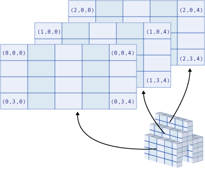

# Array Dimensions in Visual Basic
A *dimension* is a direction in which you can vary the specification of an array's elements. An array that holds the sales total for each day of the month has one dimension (the day of the month). An array that holds the sales total by department for each day of the month has two dimensions (the department number and the day of the month). The number of dimensions an array has is called its *rank*.  
  
> [!NOTE]
>  You can use the <xref:System.Array.Rank%2A> property to determine the how many dimensions an array has.  
  
## Working with Dimensions  
 You specify an element of an array by supplying an *index* or *subscript* for each of its dimensions. The elements are contiguous along each dimension from index 0 through the highest index for that dimension.  
  
 The following illustrations show the conceptual structure of arrays with different ranks. Each element in the illustrations shows the index values that access it. For example, you can access the first element of the second row of the two-dimensional array by specifying indexes `(1, 0)`.  
  
   
One-dimensional array  
  
   
Two-dimensional array  
  
   
Three-dimensional array  
  
### One Dimension  
 Many arrays have only one dimension, such as the number of people of each age. The only requirement to specify an element is the age for which that element holds the count. Therefore, such an array uses only one index. The following example declares a variable to hold a *one-dimensional array* of age counts for ages 0 through 120.  
  
```  
Dim ageCounts(120) As UInteger  
```  
  
### Two Dimensions  
 Some arrays have two dimensions, such as the number of offices on each floor of each building on a campus. The specification of an element requires both the building number and the floor, and each element holds the count for that combination of building and floor. Therefore, such an array uses two indexes. The following example declares a variable to hold a *two-dimensional array* of office counts, for buildings 0 through 40 and floors 0 through 5.  
  
```  
Dim officeCounts(40, 5) As Byte  
```  
  
 A two-dimensional array is also called a *rectangular array*.  
  
### Three Dimensions  
 A few arrays have three dimensions, such as values in three-dimensional space. Such an array uses three indexes, which in this case represent the x, y, and z coordinates of physical space. The following example declares a variable to hold a *three-dimensional array* of air temperatures at various points in a three-dimensional volume.  
  
```  
Dim airTemperatures(99, 99, 24) As Single  
```  
  
### More than Three Dimensions  
 Although an array can have as many as 32 dimensions, it is rare to have more than three.  
  
> [!NOTE]
>  When you add dimensions to an array, the total storage needed by the array increases considerably, so use multidimensional arrays with care.  
  
## Using Different Dimensions  
 Suppose you want to track sales amounts for every day of the present month. You might declare a one-dimensional array with 31 elements, one for each day of the month, as the following example shows.  
  
```  
Dim salesAmounts(30) As Double  
```  
  
 Now suppose you want to track the same information not only for every day of a month but also for every month of the year. You might declare a two-dimensional array with 12 rows (for the months) and 31 columns (for the days), as the following example shows.  
  
```  
Dim salesAmounts(11, 30) As Double  
```  
  
 Now suppose you decide to have your array hold information for more than one year. If you want to track sales amounts for 5 years, you could declare a three-dimensional array with 5 layers, 12 rows, and 31 columns, as the following example shows.  
  
```  
Dim salesAmounts(4, 11, 30) As Double  
```  
  
 Note that, because each index varies from 0 to its maximum, each dimension of `salesAmounts` is declared as one less than the required length for that dimension. Note also that the size of the array increases with each new dimension. The three sizes in the preceding examples are 31, 372, and 1,860 elements respectively.  
  
> [!NOTE]
>  You can create an array without using the `Dim` statement or the `New` clause. For example, you can call the <xref:System.Array.CreateInstance%2A> method, or another component can pass your code an array created in this manner. Such an array can have a lower bound other than 0. You can always test for the lower bound of a dimension by using the <xref:System.Array.GetLowerBound%2A> method or the `LBound` function.  
  
## See Also  
 [Arrays](../../../../visual-basic/programming-guide/language-features/arrays/index.md)  
 [Troubleshooting Arrays](../../../../visual-basic/programming-guide/language-features/arrays/troubleshooting-arrays.md)
