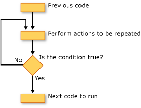

# Loop Structures (Visual Basic)
[!INCLUDE[vbprvb](~/includes/vbprvb-md.md)] loop structures allow you to run one or more lines of code repetitively. You can repeat the statements in a loop structure until a condition is `True`, until a condition is `False`, a specified number of times, or once for each element in a collection.  
  
 The following illustration shows a loop structure that runs a set of statements until a condition becomes true.  
  
   
Running a set of statements until a condition becomes true  
  
## While Loops  
 The `While`...`End While` construction runs a set of statements as long as the condition specified in the `While` statement is `True`. For more information, see [While...End While Statement](../../../../visual-basic/language-reference/statements/while-end-while-statement.md).  
  
## Do Loops  
 The `Do`...`Loop` construction allows you to test a condition at either the beginning or the end of a loop structure. You can also specify whether to repeat the loop while the condition remains `True` or until it becomes `True`. For more information, see [Do...Loop Statement](../../../../visual-basic/language-reference/statements/do-loop-statement.md).  
  
## For Loops  
 The `For`...`Next` construction performs the loop a set number of times. It uses a loop control variable, also called a *counter*, to keep track of the repetitions. You specify the starting and ending values for this counter, and you can optionally specify the amount by which it increases from one repetition to the next. For more information, see [For...Next Statement](../../../../visual-basic/language-reference/statements/for-next-statement.md).  
  
## For Each Loops  
 The `For Each`...`Next` construction runs a set of statements once for each element in a collection. You specify the loop control variable, but you do not have to determine starting or ending values for it. For more information, see [For Each...Next Statement](../../../../visual-basic/language-reference/statements/for-each-next-statement.md).  
  
## See Also  
 [Control Flow](../../../../visual-basic/programming-guide/language-features/control-flow/index.md)  
 [Decision Structures](../../../../visual-basic/programming-guide/language-features/control-flow/decision-structures.md)  
 [Other Control Structures](../../../../visual-basic/programming-guide/language-features/control-flow/other-control-structures.md)  
 [Nested Control Structures](../../../../visual-basic/programming-guide/language-features/control-flow/nested-control-structures.md)
