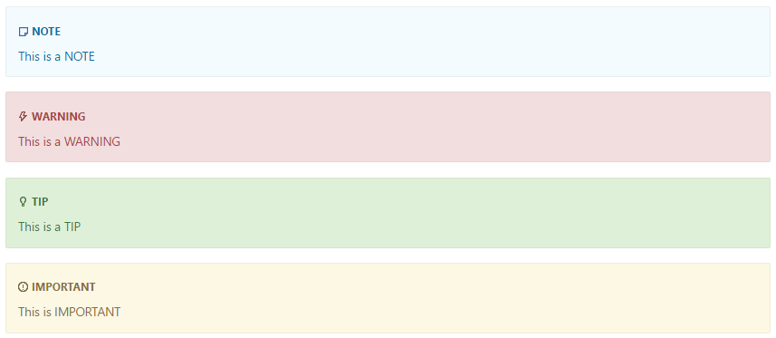

---
# required/recommended metadata

title: [ARTICLE TITLE]
description:
author: [GITHUB USERNAME]
ms.author: [MICROSOFT ALIAS OF INTERNAL OWNER]
ms.date: [CREATION/UPDATE DATE - MM/dd/yyyy]
ms.topic: [TOPIC TYPE]
ms.prod: [PRODUCT VALUE]
helpviewer_keywords: [OFFLINE BOOK INDEX ENTRIES]

# optional metadata

#ROBOTS:
#ms.technology:
#keywords:
#ms.devlang: [LANGUAGES]
#manager: [MICROSOFT ALIAS]

---
# Metadata and Markdown Template

This dotnet/docs template contains examples of Markdown syntax, as well as guidance on setting the metadata. To get the most of it, you must view both the [raw Markdown](https://raw.githubusercontent.com/dotnet/docs/master/styleguide/template.md) and the [rendered view](https://github.com/dotnet/docs/blob/master/styleguide/template.md) (for instance, the raw Markdown shows the metadata block, while the rendered view does not).

When creating a Markdown file, you should copy this template to a new file, fill out the metadata as specified below, set the H1 heading above to the title of the article, and delete the content.

## Metadata

The full metadata block is above (in the [raw Markdown](https://raw.githubusercontent.com/dotnet/docs/master/styleguide/template.md)), divided into required fields and optional fields. Some key notes:

- You **must** have a space between the colon (:) and the value for a metadata element.
- If an optional metadata element doesn't have a value, comment out the element with a # or remove it (don't leave it blank or use "na"). If you're adding a value to an element that was commented out, be sure to remove the #.
- Colons in a value (for example, a title) break the metadata parser. In this case, surround the title with double quotes (for example, `title: "Writing .NET Core console apps: An advanced step-by-step guide"`).
- **title**: Appears in search engine results. The title shouldn't be identical to the title in your H1 heading, and it should contain 60 characters or less.
- **description**: Summarizes the content of the article. It's usually shown in the search results page, but it isn't used for search ranking. Its length should be 115-145 characters including spaces.
- **author** and **ms.author**: The author field should contain the **GitHub username** of the author, not his/her alias.  The **ms.author** field, on the other hand, should contain a Microsoft alias and indicates the person responsible for maintaining the article.
- **ms.topic**: The topic type. The most common value is `conceptual` and is set at a global level. Other common values used are `tutorial`, `overview`, and `reference`.
- **ms.devlang** defines the language filter displayed for the topic. You can see a list of the supported values in the [Supported languages](#supported-languages) section. Only needs to be set when there's more than one programming language covered in the topic. Typically, we only use `csharp`, `vb`, `fsharp`, and `cpp` for this value in our content.
- **ms.prod**: Product identification used for BI purposes. They're usually set at a global level, so they don't usually appear in the metadata block of each article.
- **ms.technology**: Additional BI classification. Some of the supported values are: `devlang-csharp` for C# topics, `devlang-fsharp` for F# topics, and `devlang-visual-basic` for VB topics. For other guides, the values will vary, so ask a member of the team for guidance.
- **ms.date**: A date in the format MM/DD/YYYY. Displayed on the published page to indicate the last time the article was substantially edited or guaranteed "fresh" (that is, the article was reviewed and considered up-to-date).
- **helpviewer_keywords**: Entries are used for the offline books index (functionality in Visual Studio).
- **f1_keywords**: Connects the article to the F1 key (functionality in Visual Studio).

## Basic Markdown, GFM, and special characters

All basic and GitHub Flavored Markdown (GFM) is supported. For more information on these, see:

- [Baseline Markdown syntax](https://daringfireball.net/projects/markdown/syntax)
- [GFM documentation](https://guides.github.com/features/mastering-markdown)

Markdown uses special characters such as \*, \`, and \# for formatting. If you wish to include one of these characters in your content, you must do one of two things:

- Put a backslash before the special character to "escape" it (for example, `\*` for a \*)
- Use the [HTML entity code](https://www.ascii.cl/htmlcodes.htm) for the character (for example, `&#42;` for a &#42;).

## File name

File names use the following rules:

- Contain only lowercase letters, numbers, and hyphens.
- No spaces or punctuation characters. Use the hyphens to separate words and numbers in the file name.
- Use action verbs that are specific, such as develop, buy, build, troubleshoot. No -ing words.
- No small words - don't include a, and, the, in, or, etc.
- Must be in Markdown and use the .md file extension.
- Keep file names reasonably short. They are part of the URL for your articles.

## Headings

Use sentence-style capitalization. Always capitalize:

- The first word of a heading.
- The word following a colon in a title or heading (for example, "How to: Sort an array").

Headings should be done using atx-style, that is, use 1-6 hash characters (#) at the start of the line to indicate a heading, corresponding to HTML headings levels H1 through H6. Examples of first- and second-level headers are used above.

There **must** be only one first-level heading (H1) in your topic, which will be displayed as the on-page title.

If your heading finishes with a `#` character, you need to add an extra `#` character in the end in order for the title to render correctly. For example, `# Async Programming in F# #`.

Second-level headings will generate the on-page TOC that appears in the "In this article" section underneath the on-page title.

### Third-level heading
#### Fourth-level heading
##### Fifth level heading
###### Sixth-level heading

## Text styling

*Italics*
 Use for files, folders, paths (for long items, split onto their own line), new terms.

**Bold**
Use for UI elements.

`Code`
Use for inline code, language keywords, NuGet package names, command-line commands, database table and column names, and URLs that you don't want to be clickable.

## Links

### Internal Links

To link to a header in the same Markdown file (also known as anchor links), you'll need to find out the id of the header you're trying to link to. To confirm the ID, view the source of the rendered article, find the id of the header (for example, `id="blockquote"`), and link using # + id (for example, `#blockquote`).
The id is auto-generated based on the header text. So, for example, given a unique section named `## Step 2`, the id would look like this `id="step-2"`.

- Example: `[Declare inline blocks with a language identifier](#inline-code-blocks-with-language-identifier)` produces [Declare inline blocks with a language identifier](#inline-code-blocks-with-language-identifier).

To link to a Markdown file in the same repo, use [relative links](https://www.w3.org/TR/WD-html40-970917/htmlweb.html#h-5.1.2), including the ".md" at the end of the filename.

- Example: `[Readme file](../README.md)` produces [Readme file](../README.md). (Note that links are case-sensitive.)
- Example: `[Welcome to .NET](../docs/welcome.md)` produces [Welcome to .NET](../docs/welcome.md).

To link to a header in a Markdown file in the same repo, use relative linking + hashtag linking.

- Example: `[.NET Community](../docs/welcome.md#open-source)` produces [.NET Community](../docs/welcome.md#open-source).

In most cases, we use the relative links and discourage the use of `~/` in links because relative links resolve in the source on GitHub. However, whenever we link to a file in a dependent repo, we'll use the `~/` character to provide the path. Because the files in the dependent repo are in a different location in GitHub the links won't resolve correctly with relative links regardless of how they were written.

The C# language specification and the Visual Basic language specification are included in the .NET docs by including the source from the language repositories. The markdown sources are managed in the [csharplang](https://github.com/dotnet/csharplang) and [visual basic](https://github.com/dotnet/vblang) repositories.

Links to the spec must point to the source directories where those specs are included. For C#, it's **~/_csharplang/spec** and for VB, it's **~/_vblang/spec**.

- Example: `[C# Query Expressions](~/_csharplang/spec/expressions.md#query-expressions)` produces [C# Query Expressions](~/_csharplang/spec/expressions.md#query-expressions).

### External Links

To link to an external file, use the full URL as the link.

- Example: `[GitHub](https://www.github.com)` produces [GitHub](https://www.github.com).

If a URL appears in a Markdown file, it will be transformed into a clickable link.

- Example: `<https://www.github.com>` produces <https://www.github.com>.

Prefer the `https` protocol for external links. Only use `http` links for sites that do not support `https`.

### Links to APIs

The build system has some extensions that allow us to link to .NET APIs without having to use external links.
When linking to an API, you can use its unique identifier (UID) that is auto-generated from the source code.

The UID equates to the fully qualified type and member name.

If you add a \* (or %2A) after the UID, the link then represents the overload page and not a specific API. For example, you can use that when you want to link to the [List\<T>.BinarySearch Method](https://docs.microsoft.com/dotnet/api/system.collections.generic.list-1.binarysearch) page in a generic way instead of a specific overload such as [List\<T>.BinarySearch(T, IComparer\<T>)](https://docs.microsoft.com/dotnet/api/system.collections.generic.list-1.binarysearch#System_Collections_Generic_List_1_BinarySearch__0_). You can also use \* to link to a member page when the member is not overloaded; this saves you from having to include the parameter list in the UID.

To link to a specific method overload, you must include the fully qualified type name of each of the method's parameters. For example, \<xref:System.DateTime.ToString> links to the parameterless [DateTime.ToString](https://docs.microsoft.com/dotnet/api/system.datetime.tostring#System_DateTime_ToString) method, while \<xref:System.DateTime.ToString(System.String,System.IFormatProvider)> links to the  [DateTime.ToString(String,IFormatProvider)](https://docs.microsoft.com/dotnet/api/system.datetime.tostring#System_DateTime_ToString_System_String_System_IFormatProvider_) method. You can find the UIDs of a particular overloaded member from `https://xref.docs.microsoft.com/autocomplete`. The query string "?text=*\<type-member-name>*" identifies the type or member whose UIDs you'd like to see. For example, `https://xref.docs.microsoft.com/autocomplete?text=string.format` retrieves the [String.Format](https://docs.microsoft.com/dotnet/api/system.string.format) overloads.

To link to a generic type, such as [System.Collections.Generic.List\<T>](https://docs.microsoft.com/dotnet/api/system.collections.generic.list-1), you use the ` (%60) character followed by the number of generic type parameters. For example, \<xref:System.Nullable%601> links to the [System.Nullable\<T>](https://docs.microsoft.com/dotnet/api/system.nullable-1) type, while \<xref:System.Func%602> links to the [System.Func\<T,TResult>](https://docs.microsoft.com/dotnet/api/system.func-2) delegate.

You can use one of the following syntax:

1. Auto-link: `<xref:UID>` or `<xref:UID?displayProperty=nameWithType>`

   The `displayProperty` query    parameter produces a fully qualified link text. By default, link text shows only the member or type name.

2. Markdown link: `[link text](xref:UID)`

   Use when you want to customize the link text displayed.

Examples:

- `<xref:System.String>` renders as [String](https://docs.microsoft.com/dotnet/api/system.string)
- `<xref:System.String?displayProperty=nameWithType>` renders as [System.String](https://docs.microsoft.com/dotnet/api/system.string)
- `[String class](xref:System.String)` renders as [String class](https://docs.microsoft.com/dotnet/api/system.string)

For more information about using this notation, see [Using cross reference](https://dotnet.github.io/docfx/tutorial/links_and_cross_references.html#using-cross-reference).

There are two ways to find the UID:

- View the source for the API page you want to link to and find the ms.assetid value. Note that individual overload values are not shown in the source.
- Use the following tool to search for UIDs: https://xref.docs.microsoft.com/autocomplete?text=tostring (replace tostring with parts of the API name you're trying to find). The tool searches for the provided `text` query parameter in any part of the UID. For example, you can search for member name (ToString), partial member name (ToStri), type and member name (Double.ToString), etc.

When the UID contains the special characters \`, \# or \*, the UID value needs to be HTML encoded as `%60`, `%23` and `%2A` respectively. You'll sometimes see parentheses encoded but it's not a requirement.

Examples:

- System.Threading.Tasks.Task\`1 becomes `System.Threading.Tasks.Task%601`
- System.Exception.\#ctor becomes `System.Exception.%23ctor`
- System.Lazy\`1.\#ctor(System.Threading.LazyThreadSafetyMode) becomes  `System.Lazy%601.%23ctor%28System.Threading.LazyThreadSafetyMode%29`

## Lists

### Ordered lists

1. This
1. Is
1. An
1. Ordered
1. List

#### Ordered list with an embedded list

1. Here
1. comes
1. an
1. embedded
    1. Miss Scarlett
    1. Professor Plum
1. ordered
1. list

### Unordered Lists

- This
- is
- a
- bulleted
- list

#### Unordered list with an embedded list

- This
- bulleted
- list
  - Mrs. Peacock
  - Mr. Green
- contains
- other
  1. Colonel Mustard
  1. Mrs. White
- lists

## Horizontal rule

---

## Tables

| Tables        | Are           | Cool  |
| ------------- |:-------------:| -----:|
| col 3 is      | right-aligned | $1600 |
| col 2 is      | centered      |   $12 |
| col 1 is default | left-aligned     |    $1 |

You can use a [Markdown table generator tool](https://www.tablesgenerator.com/markdown_tables) to help creating them more easily.

## Code

The best way to include code is to include snippets from a working sample. Create your
sample following the instructions in the [contributing guide](../CONTRIBUTING.md#contributing-to-samples).

You can include the code using the following syntax:

```markdown
[!code-<language>[<name>](<pathToFile><queryoption><queryoptionvalue>)]
```

- `-<language>` (*optional* but *recommended*)
  - Language of the code snippet being referenced. For a list of supported values, see [Supported languages](#supported-languages).

- `<name>` (*optional*)
  - Name for the code snippet. It doesn’t have any impact on the output HTML, but you can use it to improve the readability of your Markdown source.

- `<pathToFile>` (*mandatory*)
  - Relative path in the file system that indicates the code snippet file to reference.

- `<queryoption>` and `<queryoptionvalue>` (*optional*)
  - Used together to specify how the code should be retrieved from the file:
    - `#`:  `#L{startlinenumber}-L{endlinenumber}` (line range) *or* `#{tagname}` (tag name).
    We discourage the use of line numbers because they are very brittle. Tag name is the preferred way of referencing code snippets.
    - `range`: `?range=1,3-5` A range of lines. This example includes lines 1, 3, 4, and 5.
    - `dedent`: `?dedent=8` Dedents the lines by a number of spaces--in this case, 8. This can be combined with the `range` and other query options that select a subset of the lines of a file.
    - `outdent`: `?outdent=8` Reverses the indent of the lines by a number of spaces--in this case, 8. This can be combined with `range` and other query options that select a subset of the lines of a file.

We recommend using the tag name option whenever possible. The tag name is the name of a region or of a code comment in the format of `Snippettagname` present in the source code. The following example shows how to refer to the tag name `1`:

```markdown
[!code-csharp[csrefKeyword#1](../../../../samples/snippets/csharp/language-reference/keywords/throw/throw-1.cs#1)]
```

And you can see how the snippet tags are structured in [this source file](https://github.com/dotnet/samples/blob/master/snippets/csharp/language-reference/keywords/throw/throw-1.cs). For details about tag name representation in code snippet source files by language, see the [DocFX guidelines](https://dotnet.github.io/docfx/spec/docfx_flavored_markdown.html#tag-name-representation-in-code-snippet-source-file).

Including snippets from full programs ensures that all code runs through our Continuous Integration (CI)
system. However, if you need to show something that causes compile time or
runtime errors, you can use inline code blocks.

### Inline code blocks with language identifier

Use three backticks (\`\`\`) + a language ID to apply language-specific color coding to a code block. Here is the list of supported languages showing the markdown label for each language ID.

#### Supported languages

|Name|Markdown label|
|-----|-------|
|ASP.NET with C#|aspx-csharp|
|ASP.NET with VB|aspx-vb|
|Azure CLI|azurecli|
|AzCopy|azcopy|
|C++|cpp|
|C#|csharp|
|C# in browser|csharp-interactive|
|Console|console|
|F#|fsharp|
|Java|java|
|JavaScript|javascript|
|JSON|json|
|NodeJS|nodejs|
|Objective-C|objc|
|PHP|php|
|PowerShell|powershell|
|Python|python|
|Ruby|ruby|
|SQL|sql|
|Swift|swift|
|VB|vb|
|XAML|xaml|
|XML|xml|

The `csharp-interactive` name specifies the C# language, and the ability to run the samples from the browser. These snippets are compiled and executed in a Docker container, and the results of that program execution are displayed in the user's browser window.

The following are examples of code blocks using the language IDs for C# (\`\`\`csharp), Python (\`\`\`python), and PowerShell (\`\`\`powershell).

##### C&#9839;

```csharp
using System;
namespace HelloWorld
{
    class Hello
    {
        static void Main()
        {
            Console.WriteLine("Hello World!");

            // Keep the console window open in debug mode.
            Console.WriteLine("Press any key to exit.");
            Console.ReadKey();
        }
    }
}
```

#### Python

```python
friends = ['john', 'pat', 'gary', 'michael']
for i, name in enumerate(friends):
    print "iteration {iteration} is {name}".format(iteration=i, name=name)
```

#### PowerShell

```powershell
Clear-Host
$Directory = "C:\Windows\"
$Files = Get-Childitem $Directory -recurse -Include *.log `
-ErrorAction SilentlyContinue
```

### Generic code block

Use three backticks (&#96;&#96;&#96;) for generic code block coding.

> The recommended approach is to use code blocks with language identifiers as explained in the previous section to ensure the proper syntax highlighting in the documentation site. Use generic code blocks only when necessary.

```
function fancyAlert(arg) {
    if(arg) {
        $.docs({div:'#foo'})
    }
}
```

## Blockquotes

> The drought had lasted now for ten million years, and the reign of the terrible lizards had long since ended. Here on the Equator, in the continent which would one day be known as Africa, the battle for existence had reached a new climax of ferocity, and the victor was not yet in sight. In this barren and desiccated land, only the small or the swift or the fierce could flourish, or even hope to survive.

## Images

### Static Image or Animated gif

```markdown

```


### Linked Image

```markdown
[](https://dot.net)
```

[](https://dot.net)

## Videos

Currently, you can embed both Channel 9 and YouTube videos with the following syntax:

### Channel 9

```markdown
> [!VIDEO <channel9_video_link>]
```

To get the video's correct URL, select the **Embed** tab below the video frame, and copy the URL from the `<iframe>` element. For example:

```markdown
> [!VIDEO https://channel9.msdn.com/Blogs/dotnet/NET-Core-20-Released/player]
```

### YouTube

To get the video's correct URL, right-click on the video, select **Copy Embed Code**, and copy the URL from the `<iframe>` element.

```markdown
> [!VIDEO <youtube_video_link>]
```

For example:

```markdown
> [!VIDEO https://www.youtube.com/embed/Q2mMbjw6cLA]
```

## docs.microsoft extensions

docs.microsoft provides a few additional extensions to GitHub Flavored Markdown.

### Alerts

It's important to use the following alert styles so they render with the proper style in the documentation site. However, the rendering engine on GitHub doesn't diferentiate them.

```markdown
> [!NOTE]
> Information the user should notice even if skimming.

> [!TIP]
> Optional information to help a user be more successful.

> [!IMPORTANT]
> Essential information required for user success.

> [!CAUTION]
> Negative potential consequences of an action.

> [!WARNING]
> Dangerous certain consequences of an action.
```

And they'll render like this:


### Includes

You can embed the Markdown of one file into another using an include.

[!INCLUDE[sample include file](../includes/sampleinclude.md)]

### Checked lists

A custom style is available for lists. You can render lists with green check marks.

> [!div class="checklist"]
> - How to create a .NET Core app
> - How to add a reference to the Microsoft.XmlSerializer.Generator package
> - How to edit your MyApp.csproj to add dependencies
> - How to add a class and an XmlSerializer
> - How to build and run the application

You can see an example of checked lists in action in the [.NET Core docs](https://docs.microsoft.com/dotnet/core/additional-tools/xml-serializer-generator).

### Buttons

> [!div class="button"]
> [button links](../docs/core/index.md)

You can see an example of buttons in action in the [Visual Studio docs](https://docs.microsoft.com/visualstudio/install/install-visual-studio#step-2---download-visual-studio).

### Selectors

> [!div class="op_single_selector"]
- [macOS](../docs/core/tutorials/using-on-macos.md)
- [Windows](../docs/core/tutorials/with-visual-studio.md)

You can see an example of selectors in action at the [Azure docs](https://docs.microsoft.com/azure/expressroute/expressroute-howto-circuit-classic).

### Step-By-Steps

>[!div class="step-by-step"]
>[Previous](../docs/csharp/expression-trees-interpreting.md)
>[Next](../docs/csharp/expression-trees-translating.md)

You can see an example of step-by-steps in action at the [C# Guide](https://docs.microsoft.com/dotnet/csharp/tour-of-csharp/program-structure).
